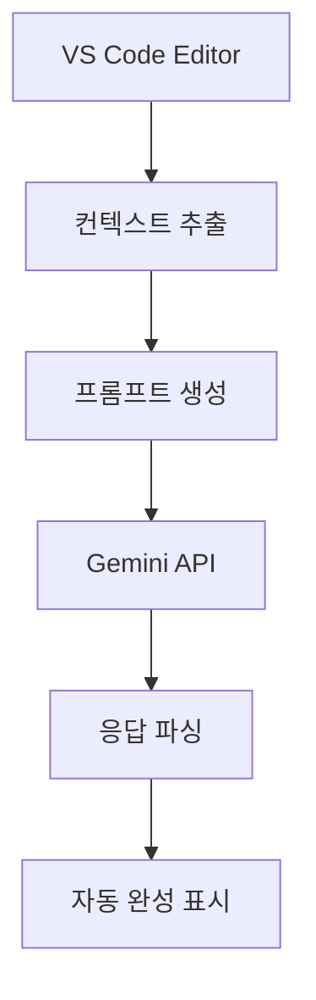

어셈블리어는 크게
+ `directive`(지시어)
+ `instruction`(명령어)
로 나눌 수 있다. 

#### Instruction (명령어)
명령어는 `mnemonic`(니모닉)과 `operand`를 가지고 있다.
`ld a, 0`이라는 명령어가 있다고 했을 때, `ld`는 mnemonic 이고, `a`와 `0`이 operand 가 된다.


이제 도구가 무엇을 하는지 알았으니 RGBASM 언어가 어떤 언어를 사용하는지 살펴 보겠습니다.

hello-world.asm의 시작 부분을 짧게 잘라서 보여드리겠습니다. 편집기가 지원하지 않더라도 줄 번호를 맞추고 구문 강조 표시를 받을 수 있도록 하기 위해서입니다.

코드 스니펫

```asm
INCLUDE "hardware.inc"
SECTION "Header", ROM0[$100]
    jp EntryPoint
    ds $150 - @, 0 ; Make room for the header
EntryPoint:
    ; Shut down audio circuitry
    ld a, 0
    ld [rNR52], a
```

분석해 보겠습니다.

RGBASM의 많은 기능을 무시할 것입니다. 더 자세한 내용을 알고 싶다면 2부와 3부를 기다리거나 문서를 읽어보세요.

### 주석

10번 줄부터 시작해 보겠습니다. 위에서 회색으로 표시되어야 합니다.

세미콜론 `;`은 주석을 나타냅니다.

세미콜론부터 줄 끝까지의 모든 내용은 RGBASM에서 무시됩니다.

7번 줄에서 볼 수 있듯이 주석이 반드시 빈 줄에 있을 필요는 없습니다.

주석은 모든 좋은 프로그래밍 언어의 필수 요소입니다. 코드가 무엇을 하는지에 대한 맥락을 제공하는 데 유용합니다.

기본적으로 "오븐을 180°C로 예열하세요"와 "케이크가 타지 않도록 오븐을 180°C로 예열하세요"의 차이입니다.

모든 언어에서 좋은 주석은 매우 유용합니다. 어셈블리에서는 많은 일반적인 의미 체계 기능을 사용할 수 없기 때문에 훨씬 더 중요한 역할을 합니다.

### 명령어

어셈블리는 매우 줄 기반 언어입니다.

각 줄은 다음 두 가지 중 하나를 포함할 수 있습니다.

- RGBASM에게 어떤 작업을 수행하도록 지시하는 _지시어_, 또는
- ROM에 직접 기록되는 _명령어_.

나중에 지시어에 대해 이야기하고 지금은 명령어에 집중해 보겠습니다. 예를 들어 위의 코드 조각에서 1번 줄(INCLUDE), 7번 줄(ds), 3번 줄(SECTION)은 무시합니다.

케이크 굽기 비유를 계속하자면, 명령어는 레시피의 단계와 같습니다.

콘솔의 프로세서(CPU)는 명령어를 하나씩 실행하고... 결국에는 뭔가 합니다!

케이크를 굽거나 "Hello World" 이미지를 그리거나 Game Boy 프로그래밍 튜토리얼을 표시하는 것과 같습니다! _윙크_ _윙크_

명령어는 _mnemonic_(기억하기 쉬운 이름)과 작동 대상인 _operand_(피연산자)를 가집니다.

예를 들어 "냄비에 초콜릿과 버터를 녹이세요"에서 전체 문장은 명령어가 되고, 동사 "녹이다"는 mnemonic이 되고, "초콜릿", "버터", "냄비"는 operand, 즉 작업에 대한 일종의 매개변수가 됩니다.

가장 기본적인 명령어인 `ld`에 대해 논의해 보겠습니다. `ld`는 "LoaD"의 약자로, 단순히 오른쪽 operand("RHS")의 데이터를 왼쪽 operand("LHS")로 복사하는 역할을 합니다.

예를 들어 11번 줄의 `ld a, 0`을 보면 값 0을 8비트 레지스터 `a`로 복사("로드")합니다.

파일을 더 살펴보면 33번 줄에 `ld a, b`가 있는데, 레지스터 `b`의 값을 레지스터 `a`로 복사합니다.

|명령어|mnemonic|효과|
|:--|:--|:--|
|로드|`ld`|값을 여기저기 복사|

ℹ️ CPU 제한으로 인해 `ld` 및 기타 많은 명령어에 대해 모든 operand 조합이 유효한 것은 아닙니다. 나중에 코드를 작성할 때 이에 대해 이야기하겠습니다.

🤔 RGBDS에는 책갈피에 추가할 가치가 있는 명령어 참조가 있으며, RGBDS가 컴퓨터(Windows 제외...)에 설치되어 있는 경우 `man 7 gbz80`을 사용하여 로컬에서 참조할 수도 있습니다.

거기에 있는 설명은 튜토리얼이 아닌 알림으로 사용하기 위한 것이므로 더 간결합니다.

### 지시어

어떤 면에서는 명령어는 콘솔의 CPU를 위한 것이고, 주석은 프로그래머를 위한 것입니다.

그러나 일부 줄은 둘 다 아니고 RGBDS 자체를 위한 일종의 메타데이터입니다.

이러한 것들을 _지시어_라고 부르며, Hello World에는 실제로 세 가지가 포함되어 있습니다.

#### 다른 파일 포함

코드 스니펫

```
INCLUDE "hardware.inc"
```

1번 줄은 `hardware.inc`를 포함합니다.

파일을 포함하는 것은 파일을 복사-붙여넣기한 것과 같은 효과를 내지만 실제로 그렇게 할 필요는 없습니다.

예를 들어 두 파일 `a.asm`과 `b.asm`이 `hardware.inc`를 포함하는 경우 `hardware.inc`를 한 번만 수정하면 `a.asm`과 `b.asm` 모두에 수정 사항이 적용됩니다.

대신 내용을 수동으로 복사-붙여넣기하면 변경 사항을 적용하기 위해 `a.asm`과 `b.asm` 모두에서 복사본을 편집해야 하므로 더 지루하고 오류가 발생하기 쉽습니다.

`hardware.inc`는 하드웨어 인터페이스와 관련된 많은 상수를 정의합니다.

상수는 기본적으로 값이 첨부된 이름이므로 이름을 쓰면 값으로 바뀝니다.

예를 들어 LCD 제어 레지스터의 주소를 `rLCDC`로 기억하는 것이 `$FF40`으로 기억하는 것보다 쉽기 때문에 유용합니다.

2부에서 상수에 대해 더 자세히 논의하겠습니다.

#### 섹션

먼저 "섹션"이 무엇인지 설명한 다음 3번 줄이 무엇을 하는지 살펴보겠습니다.

섹션은 연속된 메모리 범위를 나타내며 기본적으로 미리 알 수 없는 위치에서 끝납니다.

모든 섹션이 어디에서 끝나는지 확인하려면 `-m` 플래그를 사용하여 RGBLINK에 "맵 파일"을 생성하도록 요청할 수 있습니다.

Bash

```
rgblink hello-world.o -m hello-world.map
```

...그리고 예를 들어 "Tilemap" 섹션이 어디에서 끝났는지 확인할 수 있습니다.

```
  SECTION: $05a6-$07e5 ($0240 bytes) ["Tilemap"]
```

섹션은 RGBDS에서 분할할 수 없으므로 예를 들어 프로세서가 명령어를 바로 다음에 실행하기 때문에 코드에 유용합니다(나중에 살펴볼 점프 제외).

너무 많은 섹션과 충분하지 않은 섹션 사이에는 균형을 맞춰야 하지만 일반적으로 뱅킹이 도입될 때까지는 크게 중요하지 않습니다. 그리고 훨씬 나중에야 도입될 것입니다.

따라서 지금은 하나의 섹션에 주제별로 "함께 가는" 것들을 포함해야 한다고 가정하고, 우리 섹션 중 하나를 살펴보겠습니다.

코드 스니펫

```
SECTION "Header", ROM0[$100]
```

자! 무슨 일이 일어나고 있는 걸까요?

새로운 섹션을 선언하는 것입니다. 이 줄 뒤부터 다음 SECTION 줄까지의 모든 명령어와 데이터는 새로 생성된 이 섹션에 배치됩니다.

첫 번째 SECTION 지시어 전에는 "활성" 섹션이 없으므로 코드나 데이터를 생성하면 "Cannot output data outside of a SECTION" 오류가 발생합니다.

새 섹션의 이름은 "Header"입니다.

섹션 이름은 임의의 문자를 포함할 수 있으며(비어 있어도 됨) 고유해야 합니다.

`ROM0` 키워드는 섹션이 속한 "메모리 유형"을 나타냅니다(여기에 목록이 있습니다).

2부에서 이에 대해 논의하겠습니다.

`[$100]` 부분은 이 섹션에만 해당되므로 더 흥미롭습니다.

위에서 다음과 같이 말했습니다.

> 섹션은 [...] 기본적으로 미리 알 수 없는 위치에서 끝납니다.

그러나 일부 메모리 위치는 특별하므로 때로는 특정 섹션이 특정 메모리 범위를 span하도록 해야 합니다.

이를 위해 RGBASM은 섹션의 시작 주소를 `addr`로 강제하는 `[addr]` 구문을 제공합니다.

이 경우 메모리 범위 `$100–$14F`는 특별합니다. ROM의 헤더이기 때문입니다.

몇 번의 강의에서 헤더에 대해 논의하겠지만 지금은 해당 공간에 코드나 데이터를 넣을 필요가 없다는 것만 알아두세요.

어떻게 해야 할까요?

먼저 주소 `$100`에서 섹션을 시작한 다음 공간을 예약해야 합니다.

#### 공간 예약

코드 스니펫

```
    jp EntryPoint
    ds $150 - @, 0 ; Make room for the header
```

7번 줄은 "헤더를 위한 공간을 만든다"고 주장하며, 위에서 잠깐 언급했었습니다.

지금은 `ds`가 실제로 무엇을 하는지에 집중해 보겠습니다.

`ds`는 메모리를 정적으로 할당하는 데 사용됩니다.

단순히 주어진 값으로 설정된 특정 바이트 수를 예약하는 것입니다.

여기서 `ds`의 첫 번째 인수인 `$150 - @`는 예약할 바이트 수입니다.

두 번째 (선택적) 인수인 여기서는 `0`은 예약된 각 바이트에 설정할 값입니다.

이러한 바이트를 예약해야 하는 이유는 몇 강의 후에 알게 될 것입니다.

여기서 첫 번째 인수가 _표현식_이라는 점은 주목할 만합니다.

RGBDS는 (고맙게도!) 기본적으로 어디에서나 임의의 표현식을 지원합니다.

이 표현식은 간단한 뺄셈입니다. `$150`에서 `@`를 뺀 값인데, `@`는 "현재 메모리 주소"를 나타내는 특별한 심볼입니다.

심볼은 기본적으로 "값(보통 숫자)"에 연결된 이름입니다.

다음 섹션의 레이블부터 시작하여 튜토리얼 전체에서 다양한 유형의 심볼을 살펴볼 것입니다.

표현식에 사용된 숫자 심볼은 해당 값으로 평가되는데, 이 값은 ROM을 컴파일할 때 알려져야 합니다. 특히 레지스터의 내용에 따라 달라질 수 없습니다.

아, 제가 계속 언급하는 "메모리 주소"가 무엇인지 궁금할 수도 있겠습니다.

그것에 대해 알아보겠습니다!

1. 엄밀히 말하면 RGBASM의 명령어는 지시어로 구현되며, 기본적으로 ROM에 인코딩된 형태로 작성됩니다. 하지만 소스 코드의 명령어와 최종 ROM의 명령어 사이의 차이점을 지금 언급할 필요는 없습니다.
2. 호기심 많은 독자는 값이 어디에서 복사되는지 물어볼 수 있습니다. 대답은 단순히 "immediate" 바이트(이 예에서는 $00)가 명령어의 opcode 바이트 바로 뒤의 ROM에 저장되고, 이것이 `a`로 복사되는 것입니다. 나중에 명령어가 어떻게 인코딩되는지 이야기할 때 다시 다룰 것입니다.
3. `hardware.inc` 자체는 더 많은 지시어를 포함하고 있는데, 특히 많은 심볼을 정의하는 데 사용됩니다. 나중에 다룰 것이므로 지금은 `hardware.inc`를 살펴보지 않을 것입니다.
4. 섹션 이름은 실제로 "일반" 섹션에 대해서만 고유하면 되고, "unionized" 및 "fragment" 섹션에서는 다르게 작동하는데, 이는 나중에 논의할 것입니다.
5. 실제로 RGBASM 0.5.0부터 `ds`는 바이트 목록을 허용할 수 있으며, 지정된 바이트 수만큼 패턴을 반복합니다. 설명을 약간 복잡하게 만들어서 지금은 생략했습니다. 또한 인수가 생략되면 RGBASM의 `-p` 옵션을 사용하여 지정된 값으로 기본 설정됩니다.


