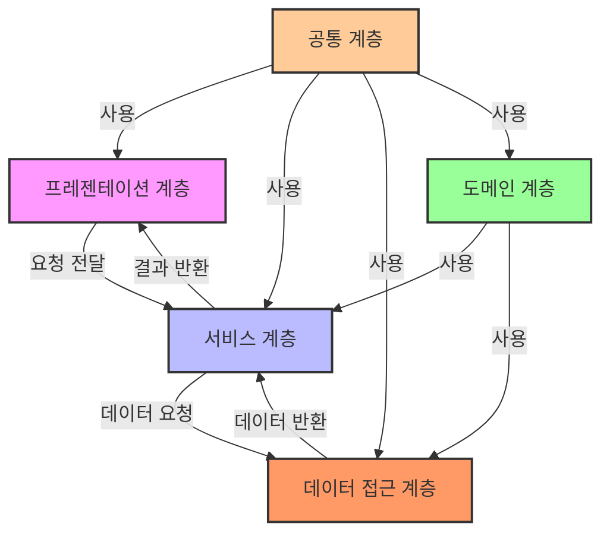

# 스프링 부트 3 구조 살펴보기
## 계층
카페에서 커피팔고, 빵집에선 빵 파는데 카페랑 빵집이 협업해서 할인 이벤트 할 수도 있음 (계층 간 소통)
근데 빵집 알바가 카페에서 커피 못팜 (계층 간 서로 영향 못끼침)

### 프레젠테이션 계층 (컨트롤러)
**HTTP 요청**을 받고 요청을 **비즈니스 계층(서비스)**으로  전달
`TestController` 클래스 같은 것들

### 비즈니스 계층 (서비스)
비즈니스 로직[^비즈니스로직]을 처리

ex. 주문 서비스 -> 주문 데이터를 처리하기 위한 로직, 주문 처리 예외처리 로직, 주문 취소 프로세스 구현 로직 등등등...

### 퍼시스턴스 계층 (리포지토리)
데이터베이스 관련 로직 처리
처리 과정에서 **DAO**[^DAO]객체를 사용할 수 있음.

## 스프링 부트 프로젝트 디렉토리 구성하며 살펴보기
### main
실제 코드를 작성하는 공간
### test
테스트용 코드를 위한 공간
### `build.gradle`
빌드를 설정하는 파일. 의존성, 플러그인 설정 등

### `settings.gradle`
빌드할 프로젝트의 정보를 설정

## main 디렉토리 구성하기
`src/main/resources`폴더에 `static`, `templates`폴더를 만들고 `application.yml`파일을 만든다.

+ `templates`: HTML같은 뷰 관련 파일
+ `static`: JS, CSS, 이미지 같은 정적 파일
+ `application.yml`: 스프링 부트 서버 실행시 자동으로 로딩되는 파일
	+ DB 설정 정보
	+ 로깅 설정 정보 등

[^비즈니스로직]:서비스를 만들기 위한 로직
[^DAO]:데이터베이스 계층과 상호작용하기 위한 객체